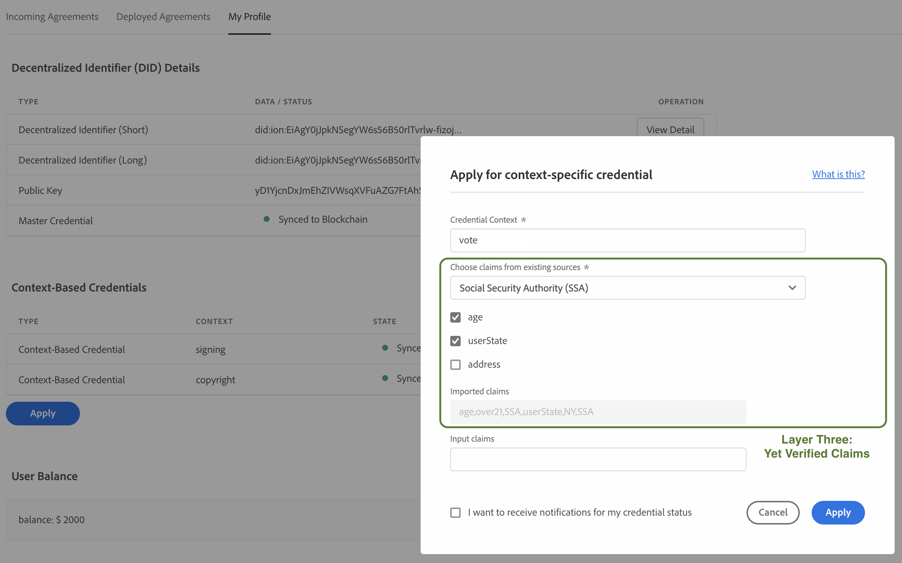
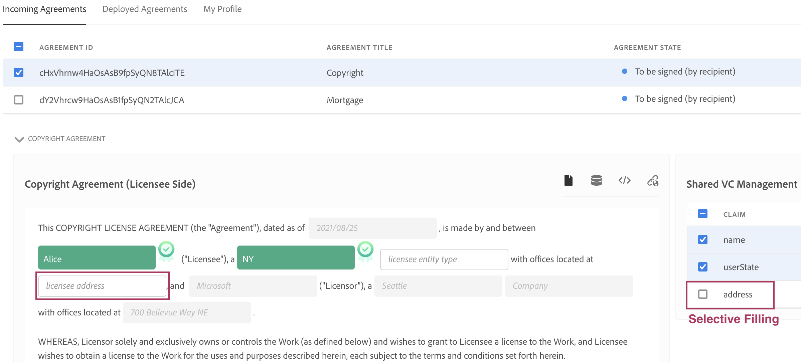

## Secure and Efficient Agreement Signing

### Decentralized Identity-Based Model

- Layer I and Layer II's User Credentials

- Layer III's User Claims

### Agreement Signing

- Auto-filling

- Selective Filling

- Handling Content-Intensive Agreements

- Clause Enabling

